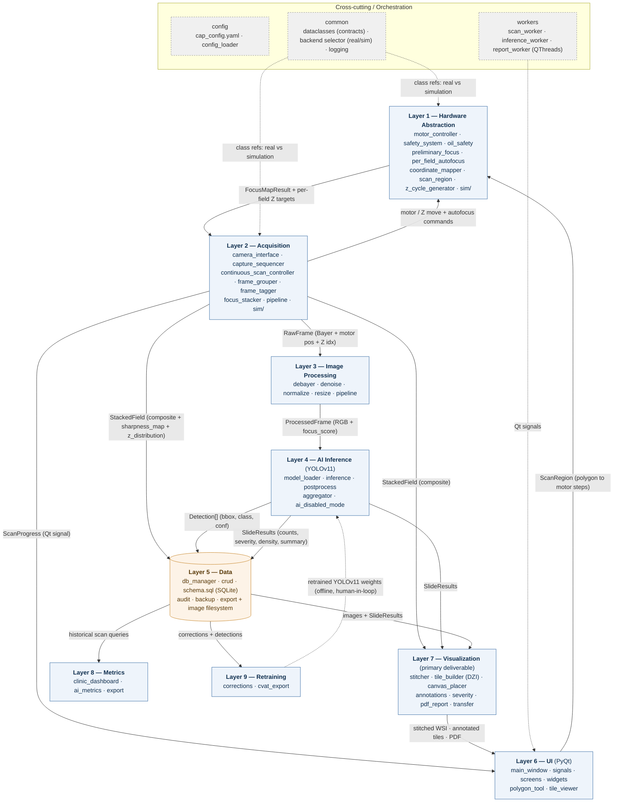

# CAP — Multi-Layer Software Architecture

CAP (Cytology Analysis Project) is a veterinary ear-cytology automation system
that runs entirely on an NVIDIA Jetson Orin Nano, offline. The software is
organized into **nine functional layers** plus a cross-cutting orchestration
tier. Every object that crosses a layer boundary is a formal dataclass defined
in [`common/dataclasses.py`](../../common/dataclasses.py) — the edge labels in
the diagram below are those exact contracts.

## Layer block diagram

## Interface contract summary

| From → To | Interface (payload) | Direction / nature |
|-----------|--------------------|--------------------|
| L6 → L1 | `ScanRegion` (polygon in motor steps) | Command — defines scan area |
| L1 → L2 | `FocusMapResult` (focal-surface polynomial) + per-field Z targets | Data — focus prediction |
| L2 → L1 | motor/Z move + autofocus calls | Command (via `motor_controller`) |
| L2 → L3 | `RawFrame` (Bayer + motor pos + Z index) | Stream, per Z-depth, via queue |
| L2 → L5 / L7 | `StackedField` (composite + `sharpness_map` + `z_distribution`) | Data — all-in-focus field |
| L2 → L6 | `ScanProgress` | Qt signal — live progress/ETA |
| L3 → L4 | `ProcessedFrame` (RGB + `focus_score`) | Stream — AI-ready image |
| L4 → L5 | `Detection[]` (bbox, class, confidence) | Data — per-field detections |
| L4 → L5 / L7 | `SlideResults` (counts, severity, density, summary) | Data — slide-level aggregate |
| L5 → L7 | images + `SlideResults` | Query — for stitching/PDF |
| L5 → L8 | historical scan/detection queries | Query — analytics |
| L5 → L9 | corrections + detections | Query — dataset curation |
| L7 → L6 | stitched WSI, annotated tiles, PDF | Display / deliverable |
| L9 ⤏ L4 | retrained YOLOv11 weights | **Offline loop** (human-in-loop) |
| Cross-cut | `common.dataclasses`, `backend` (real/sim), `config`, `workers`, Qt `signals` | Orchestration |

## Design notes

- **Z-stacking** (`z_cycle_generator` → `focus_stacker`) captures multiple focal
  planes per field for organism coverage across depths and picks the sharpest
  block per region into `StackedField.sharpness_map` / `z_distribution`. This is
  a discrete Layer 2 stage feeding both storage and visualization.
- **Imaging-first**: Layer 4 has an explicit `ai_disabled_mode`; Layers 5/7 still
  produce the stitched image and PDF when no model is loaded, matching the
  product's "value through imaging alone" priority.
- **Layer 1 is the only hardware owner**, and `backend.py` swaps Layers 1/2 for
  their `sim/` implementations — so Layers 3–9 behave identically in simulation
  and on real hardware.
